# UD3_AC11 - Persistencia avanzada con MySQL

**Autor:** Manuel Infantes Rodríguez
**Fecha:** Mayo 2026
**Módulo:** Programación Web (2º DAM)

---

## 1. Versiones utilizadas

- **Node.js:** v24.11.1
- **Express:** v5.1.0
- **MySQL:** 8.4

---

## 2. Explicación del paso de JSON a MySQL

### Limitaciones del archivo JSON

El sistema anterior utilizaba un archivo `reservas.json` para almacenar los datos de forma persistente. Este sistema presentaba varias limitaciones:

1. **Concurrencia limitada:** Si varios usuarios realizaban reservas simultáneamente, podría haber conflictos de lectura/escritura.
2. **Sin soporte multiusuario real:** No existía un mecanismo robusto para asociar cada reserva a un usuario específico de forma segura.
3. **Dificultad para escalar:** A medida que crece el número de reservas, el archivo JSON se vuelve difícil de manejar y consultar.
4. **Sin transacciones:** No se podían原子操作 (operaciones atomic).
5. **Búsqueda limitada:** Consultar o filtrar reservas era lento y requer cargar todo el archivo en memoria.

### Qué aporta MySQL al sistema de reservas

MySQL proporciona:

1. **Persistencia real y duradera:** Los datos se almacenan de forma permanente en la base de datos.
2. **Soporte multiusuario:** Cada reserva puede asociarse a un usuario específico.
3. **Consultas eficientes:** Se pueden buscar, filtrar y ordenar datos de forma rápida.
4. **Integridad de datos:** Se pueden definir tipos de datos, restricciones y validaciones.
5. **Seguridad:** Control de acceso a nivel de usuario y protección contra inyección SQL.
6. **Escalabilidad:** Capacidad de manejar grandes volúmenes de datos sin degradación del rendimiento.

---

## 3. Descripción de la base de datos y tabla

### Base de datos

- **Nombre:** `reservas_web`
- **Motivo:** Almacenar las reservas de entradas para conciertos y eventos.

### Tabla reservas

```sql
CREATE TABLE reservas (
    id INT AUTO_INCREMENT PRIMARY KEY,
    fecha VARCHAR(50) NOT NULL,
    tipo VARCHAR(100) NOT NULL,
    unidades INT NOT NULL,
    precio DECIMAL(10,2) NOT NULL,
    usuario VARCHAR(100) NOT NULL
);
```

---

## 4. Explicación de los campos de la tabla

| Campo | Tipo | Función |
|-------|------|---------|
| **id** | INT AUTO_INCREMENT PRIMARY KEY | Identificador único y automático de cada reserva. Se genera automáticamente al insertar. |
| **fecha** | VARCHAR(50) | Fecha y hora del evento reservado. |
| **tipo** | VARCHAR(100) | Nombre o tipo de evento (rock, jazz, teatro...). |
| **unidades** | INT | Número de entradas reservadas. |
| **precio** | DECIMAL(10,2) | Precio total de la reserva (con dos decimales). |
| **usuario** | VARCHAR(100) | Email del usuario que ha realizado la reserva. Permite asociar cada reserva a su propietario. |

---

## 5. Conexión de Node.js con MySQL

### mysql2

Paquete de Node.js que permite conectar el servidor Express con MySQL. Proporciona una API para ejecutar consultas SQL desde JavaScript de forma asíncrona.

### dotenv

Paquete que permite cargar las variables de entorno desde un archivo `.env`. Esto evita escribir contraseñas o datos sensibles directamente en el código.

### Archivo .env

Archivo de configuración que contiene los datos de conexión:

```
DB_HOST=localhost
DB_USER=root
DB_PASSWORD=1234
DB_NAME=reservas_web
DB_PORT=3306
```

### Archivo db.js

Módulo de configuración situado en `src/config/db.js` que:

1. Importa `mysql2/promise` y `dotenv`
2. Carga las variables del archivo `.env` con `dotenv.config()`
3. Crea un **pool de conexiones** reutilizables con `mysql.createPool()`
4. Exporta el pool para usarlo en otros archivos
5. Exporta una función `comprobarConexion()` para verificar que la conexión funciona al iniciar el servidor

El pool permite gestionar múltiples conexiones de forma eficiente, evitando abrir y cerrar una conexión nueva en cada consulta.

---

## 6. Cambios en reservasService.js

El archivo `src/services/reservasService.js` ha sido modificado para usar MySQL en lugar de JSON.

### guardarReserva(reserva)

Inserta una nueva reserva en la tabla `reservas`. Recibe un objeto `Reserva` con los datos y devuelve el `id` generado por MySQL.

```sql
INSERT INTO reservas (fecha, tipo, unidades, precio, usuario) VALUES (?, ?, ?, ?, ?)
```

### obtenerReservasPorUsuario(usuario)

Recupera todas las reservas asociadas a un usuario concreto. Utiliza el email del usuario como filtro para devolver solo sus propias reservas.

```sql
SELECT id, fecha, tipo, unidades, precio, usuario FROM reservas WHERE usuario = ? ORDER BY id DESC
```

### actualizarReserva(id, reserva, usuario)

Modifica los datos de una reserva existente. Solo permite actualizar si el `id` pertenece al `usuario` autenticado.

```sql
UPDATE reservas SET fecha = ?, tipo = ?, unidades = ?, precio = ? WHERE id = ? AND usuario = ?
```

### eliminarReserva(id, usuario)

Elimina una reserva de la base de datos. Solo permite eliminar si el `id` pertenece al `usuario` autenticado.

```sql
DELETE FROM reservas WHERE id = ? AND usuario = ?
```

Todas las funciones usan **consultas parametrizadas** (con `?`) para prevenir inyección SQL.

---

## 7. Cambios en server.js

### POST /reserva

Ruta protegida que recibe los datos del formulario de reserva. Utiliza el middleware `requiereAutenticacion` para verificar que el usuario ha iniciado sesión.

1. Valida los datos del formulario
2. Obtiene el usuario desde `req.session.usuario` (no desde el formulario)
3. Crea un objeto `Reserva` con los datos
4. Llama a `guardarReserva()` para insertar en MySQL
5. Devuelve el ID generado

### GET /reservas

Ruta protegida que devuelve en formato JSON las reservas del usuario autenticado.

1. Obtiene el usuario desde la sesión
2. Llama a `obtenerReservasPorUsuario(usuario)`
3. Devuelve el array de reservas en formato JSON

### POST /reservas/actualizar

Ruta protegida que permite actualizar una reserva existente.

1. Recibe id, fecha, tipo, unidades y precio
2. Verifica que el usuario es el propietario (dentro del service)
3. Llama a `actualizarReserva()` con el id y el usuario
4. Devuelve mensaje de éxito o error

### POST /reservas/eliminar

Ruta protegida que permite eliminar una reserva existente.

1. Recibe el id de la reserva
2. Verifica que el usuario es el propietario (dentro del service)
3. Llama a `eliminarReserva()` con el id y el usuario
4. Devuelve mensaje de éxito o error

---

## 8. Asociación de reservas al usuario autenticado

Las reservas se asocian al usuario mediante `req.session.usuario`. Cuando un usuario inicia sesión correctamente, el servidor guarda su email en la sesión:

```javascript
req.session.usuario = email;
```

Al crear, actualizar o eliminar una reserva, el servidor toma el usuario desde la sesión y lo incluye en la consulta SQL. Esto garantiza que cada reserva queda vinculada al usuario que la ha creado.

---

## 9. Por qué el usuario no debe obtenerse desde el formulario

Obtener el usuario desde un campo editable del formulario sería un **fallo de seguridad**. Un usuario malintencionado podría manipular el formulario para enviar otro email y crear reservas en nombre de otra persona.

Al obtener el usuario desde `req.session.usuario`, el servidor toma el dato de una fuente fiable (la sesión activa en el servidor) y no del cliente. Esto impide que un atacante pueda suplantar la identidad de otro usuario.

---

## 10. Cómo se evita que un usuario actualice o elimine reservas de otro

Las funciones del servicio incluyen el usuario en la condición WHERE de las consultas SQL:

```sql
WHERE id = ? AND usuario = ?
```

Esto significa que，即使 el usuario conoce el id de otra reserva, la consulta solo afectará a filas donde el usuario coincida con el de la sesión activa. Si el id no pertenece al usuario autenticado, `affectedRows` será 0 y el servidor devolverá un error.

---

## 11. Capturas de pantalla

### Conexión correcta con MySQL en la terminal
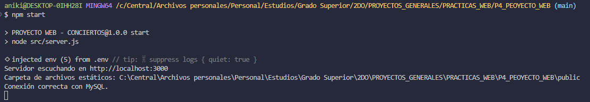

### Estructura de la tabla reservas
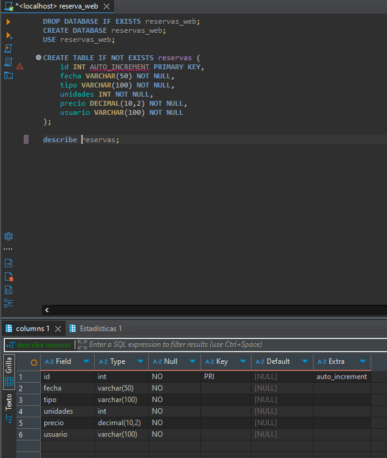

### Inserción correcta de una reserva
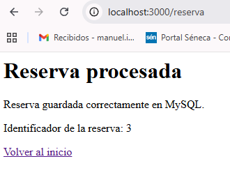
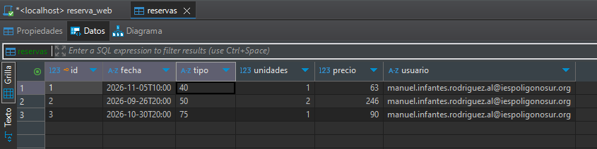

### Consulta de reservas desde /reservas
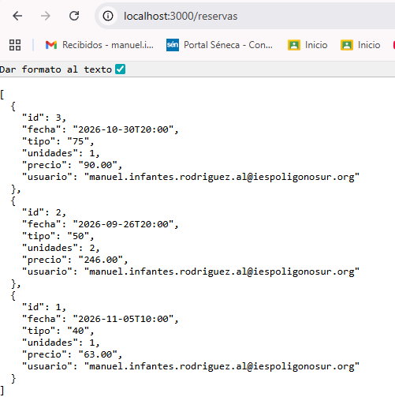

### Actualización correcta de una reserva
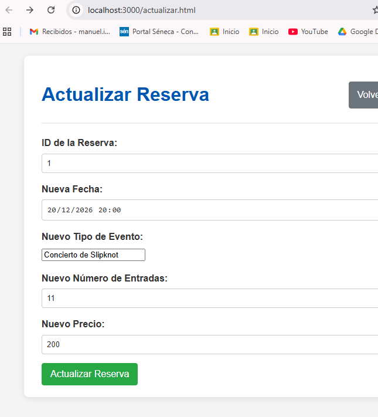

### Eliminación correcta de una reserva
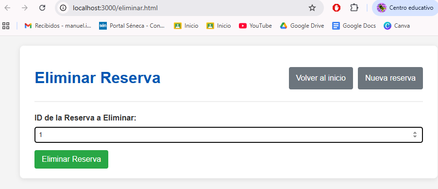
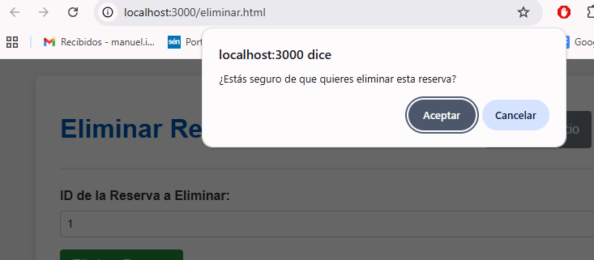
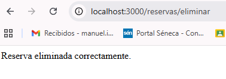
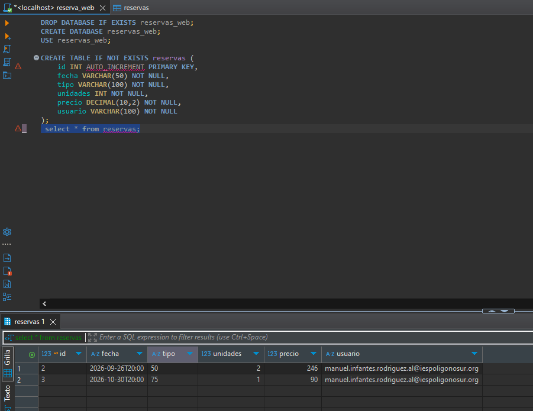

### Bloqueo de operación sin sesión activa
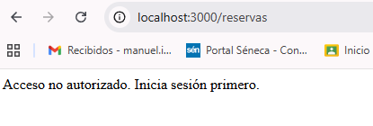

---

## 12. Dificultades técnicas encontradas

### Dificultad 1: El formulario no enviaba el precio

**Problema:** El formulario de reserva calculaba el precio visualmente pero no lo enviaba al servidor.

**Solución:** Se añadió un campo oculto `<input type="hidden" id="precio" name="precio">` y se modificó el JavaScript para actualizar su valor cada vez que se recalculaba el precio total.

### Dificultad 2: Errores en las consultas SQL por nombres de campos incorrectos

**Problema:** Los nombres de los campos en el formulario (evento, entradas) no coincidían exactamente con los esperados en la clase Reserva.

**Solblema:** Se ajustó la ruta POST /reserva para mapear correctamente los campos del formulario a los parámetros del constructor de Reserva.

### Dificultad 3: La clase Reserva necesitaba el campo usuario

**Problema:** La tabla MySQL incluye el campo usuario pero la clase solo tenía fecha, tipo, unidades, precio y comentarios.

**Solución:** Se modificó la clase Reserva para incluir el campo usuario, eliminando comentarios ya que no estaba en la estructura de la tabla.

---

## 13. Estructura final del proyecto

```
Backend_Reservas/
 │
 ├── src/
 │ ├── server.js
 │ ├── config/
 │ │ └── db.js
 │ ├── models/
 │ │ └── Reserva.js
 │ ├── services/
 │ │ └── reservasService.js
 │ ├── middlewares/
 │ │ └── authMiddleware.js
 │ └── data/
 │ │ └── reservas.json
 │
 ├── public/
 │ ├── index.html
 │ ├── login.html
 │ ├── reserva.html
 │ ├── resumen.html
 │ ├── actualizar.html
 │ ├── eliminar.html
 │ ├── css/
 │ │ └── style.css
 │ ├── js/
 │ │ └── script.js
 │ └── img/
 │
 ├── capturas/
 ├── .gitignore
 ├── package.json
 ├── package-lock.json
 ├── .env
 ├── README.md
 └── README11.md
```

---

## 14. Conclusión

La migración de JSON a MySQL ha transformado el sistema de reservas en una aplicación más robusta, segura y escalable. El sistema ahora permite:

- Persistencia real de datos
- Asociación de reservas a usuarios autenticados
- Operaciones CRUD completas con seguridad
- Prevención de acceso a datos de otros usuarios
- Capacidad de escalar a futuro