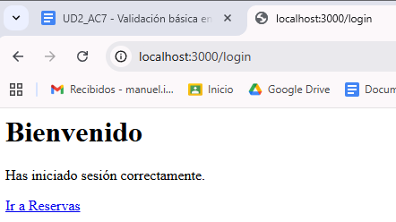
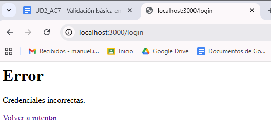
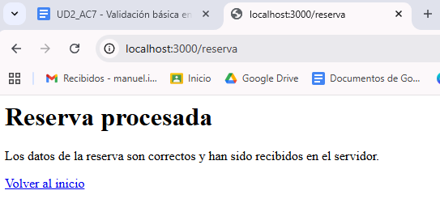
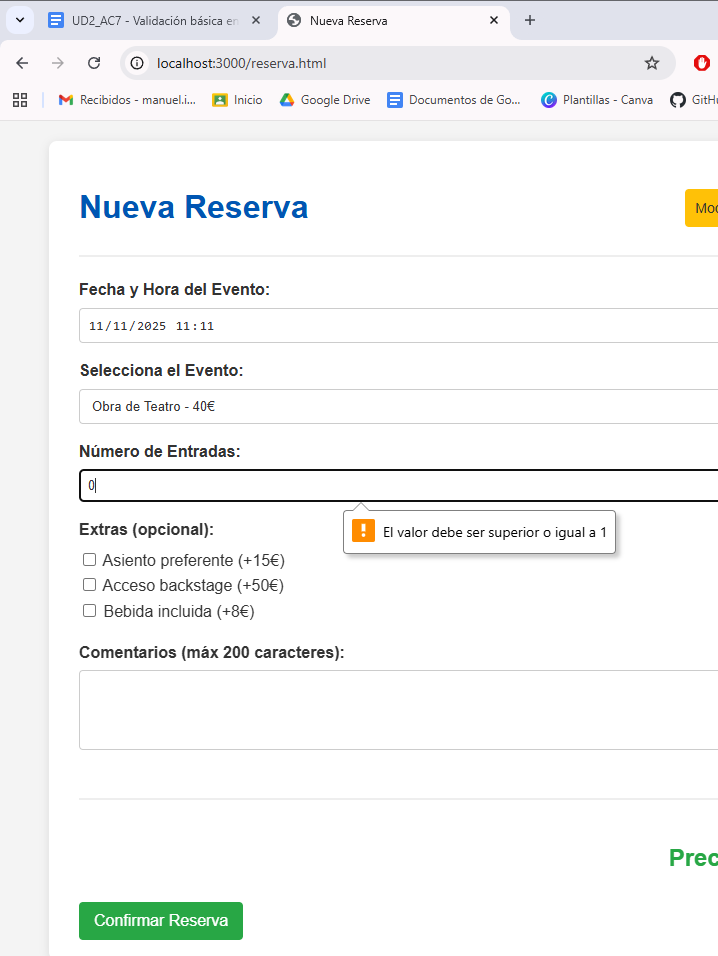
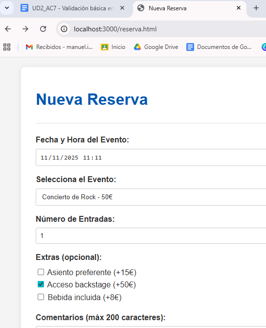
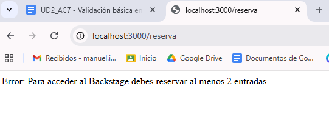
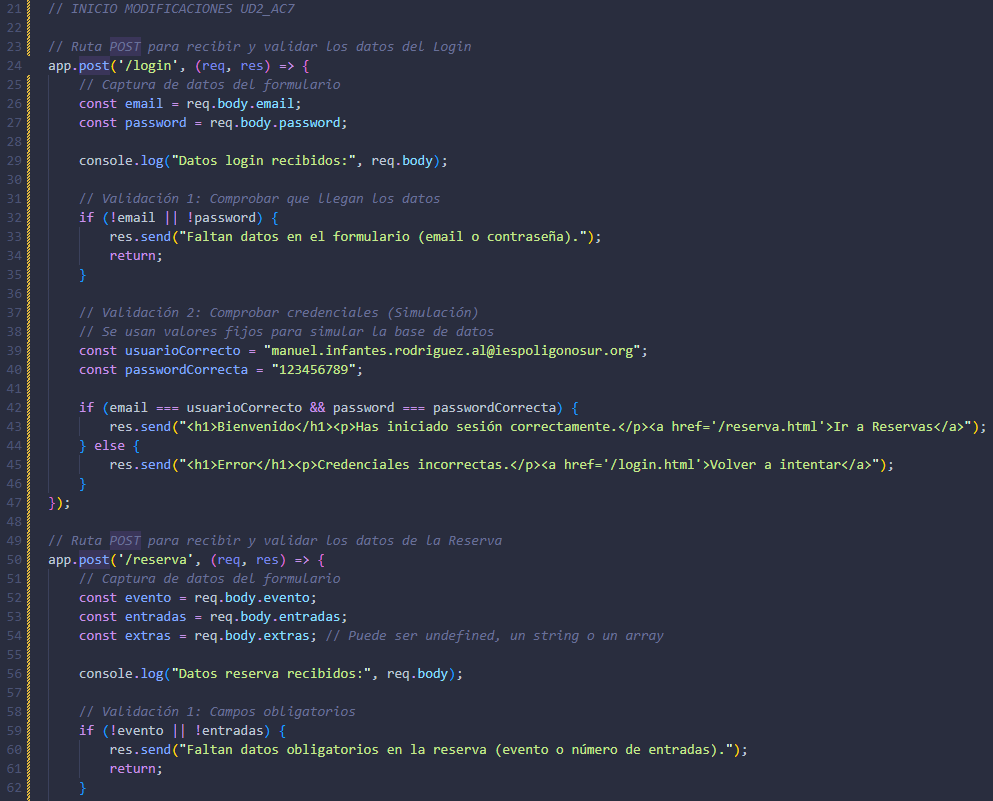
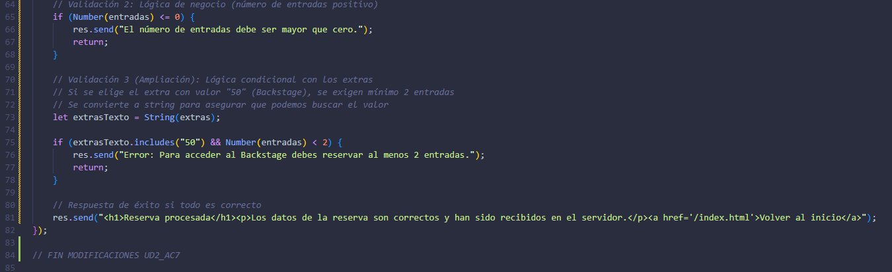
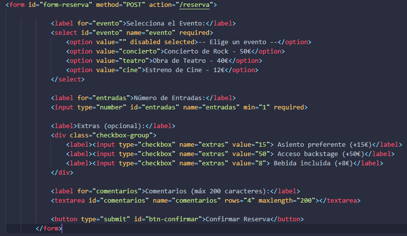
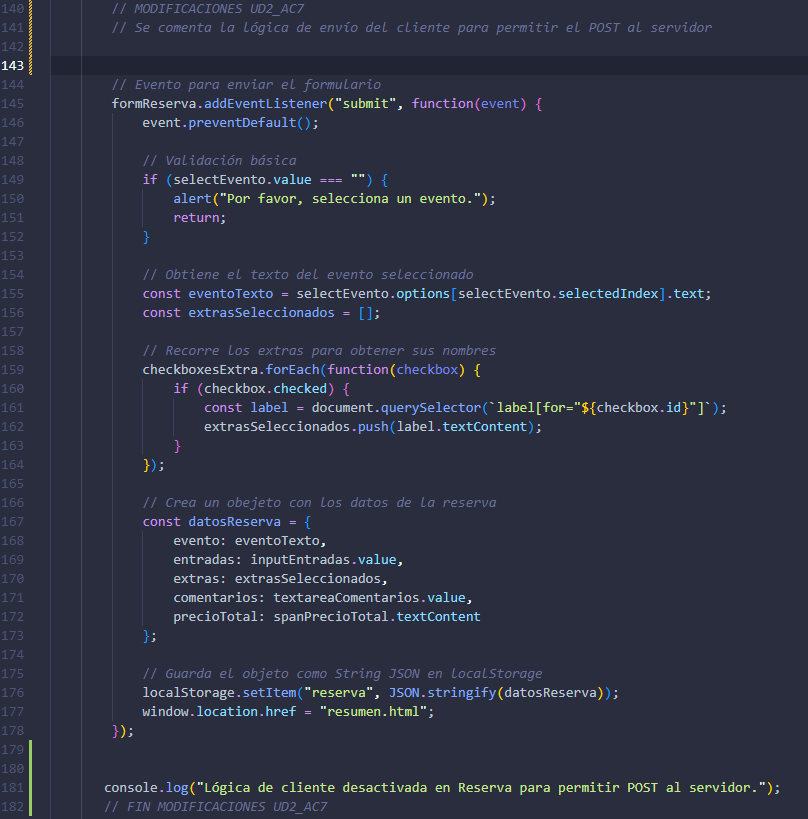

# UD2_AC7 Validación básica en backend y respuestas dinámicas

**Objetivo:** Procesar datos enviados desde formularios HTML en el servidor Express mediante peticiones POST, aplicando validaciones básicas y lógica condicional en el backend para generar respuestas dinámicas.

## 1. Validación del Login

He implementado una lógica de validación básica en la ruta POST `/login` del archivo `server.js`.

**Funcionamiento:**
El servidor recibe el email y la contraseña. Compara los datos recibidos con unas credenciales fijas almacenadas en el código simulando una base de datos.

* **Caso de Éxito:** Si coinciden, devuelve una respuesta de bienvenida.
* **Caso de Error:** Si no coinciden, devuelve un mensaje indicando que las credenciales son incorrectas.

**Login Correcto:**

**Login Incorrecto:**

## 2. Validación de la Reserva

He creado la ruta POST `/reserva` para procesar los datos del formulario de reservas.

**Lógica Implementada:**
1.  **Campos obligatorios:** Verifica que se haya seleccionado un evento.
2.  **Validación numérica:** Comprueba que el número de entradas sea mayor que cero.

**Reserva procesada correctamente:**

**Intento de Reserva con datos no válidos (0 entradas):**

## 3. Ampliación: Validación Adicional (Regla de Negocio)

Como requisito de ampliación, he programado una regla específica que relaciona los **extras** con el **número de entradas**.

**La Regla:**
El pase **Backstage (+50€)** es un servicio exclusivo que requiere la compra de **al menos 2 entradas**. Si el usuario marca la casilla de Backstage pero solo compra 1 entrada, el servidor detecta la incoherencia y bloquea la reserva.

**Configuración del error (1 entrada + Backstage):**

**Respuesta del Servidor (Validación backend):**

## 4. Aprendizaje y Dificultades

### ¿Qué he aprendido?
* A utilizar `app.use(express.urlencoded...)` para poder leer los datos que vienen de un formulario HTML.
* A crear lógica condicional (`if/else`) dentro de las rutas del servidor para validar datos (nulos, negativos o reglas lógicas complejas).
* A enviar respuestas HTML dinámicas (`res.send`) que cambian según si la validación es correcta o incorrecta.

### Dificultades Resueltas
La principal dificultad fue entender por qué el servidor no recibía los datos al principio. El problema era que nuestro archivo `script.js` antiguo estaba interceptando el envío con `event.preventDefault()`. La solución fue comentar esa parte del código Javascript del cliente para dejar que el formulario funcionase de forma nativa enviando los datos al backend.

## 5. Modificaciones del Código

Para lograr el funcionamiento del backend, he realizado cambios clave en los tres archivos principales del proyecto.

### A. server.js (Backend)
Se ha añadido la configuración para recibir datos y las rutas POST con toda la lógica de validación.

**Captura 1: Ruta Login y configuración:**

**Captura 2: Ruta Reserva y validación de ampliación:**

### B. public/reserva.html (Frontend)
Se ha modificado la etiqueta `<form>` para apuntar al servidor (`action="/reserva"`, `method="POST"`) y se han añadido los atributos `name` a todos los inputs para que el servidor pueda leerlos.

**Captura HTML:**

### C. public/js/script.js (Lógica Cliente)
**IMPORTANTE:** Se ha comentado el bloque de código que prevenía el envío del formulario. Esto es fundamental para que la petición llegue al servidor Express.

**Captura Script desactivado:**
